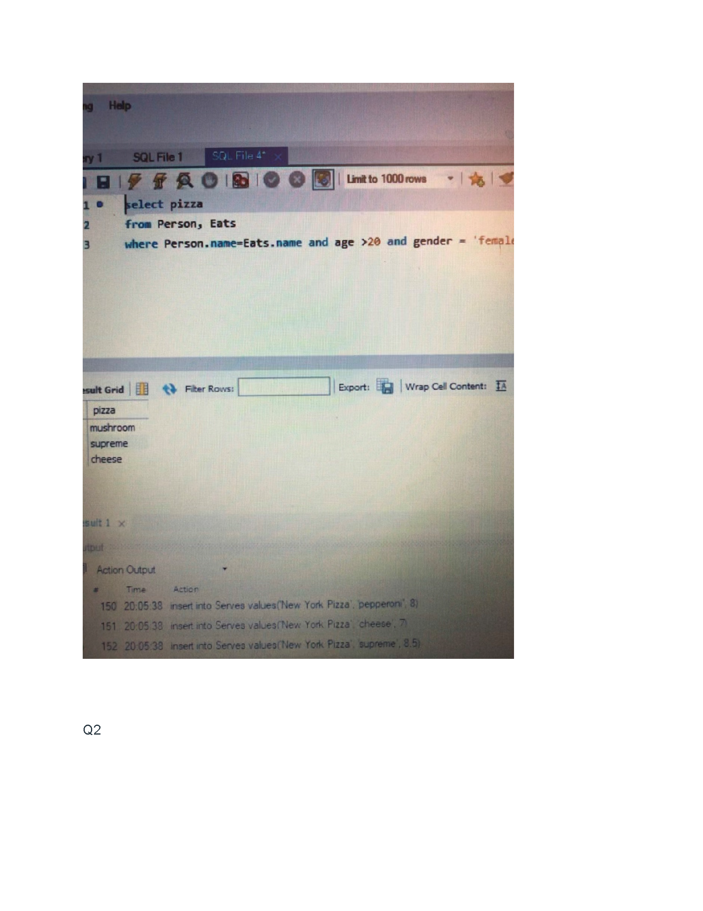

These images show some work samples from DSBA 6160 (Big Data Design, Storage, and Provenance) at UNCC. For database queries we used primarily SQL, MySQL, and SQLite.

While there was no final project for this course, I did have the opportunity to begin looking at a very big MIT medical data set. This was exciting and prompted me to begin some independent learning in cloud computing. With the support of my professor, Dr. Yaorong Ge, I was able to go beyond the scope of the course's requirements, designing an Azure cloud computing system capable of handling the full data set and its queries.

   <section style="position:relative">
      

        

          <ul class="glide__slides">
            <li class="glide__slide">
              
            </li>
            <li class="glide__slide">
              
            </li>
            <li class="glide__slide">
              
            </li>
            <li class="glide__slide">
              
            </li>
            <li class="glide__slide">
              
            </li>
             <li class="glide__slide">
              
            </li><li class="glide__slide">
              
            </li><li class="glide__slide">
              
            </li><li class="glide__slide">
              
            </li><li class="glide__slide">
              
            </li><li class="glide__slide">
              
            </li><li class="glide__slide">
              
            </li><li class="glide__slide">
              
            </li><li class="glide__slide">
              
            </li><li class="glide__slide">
              
            </li><li class="glide__slide">
              
            </li><li class="glide__slide">
              
            </li><li class="glide__slide">
              
            </li><li class="glide__slide">
              
            </li><li class="glide__slide">
              
            </li><li class="glide__slide">
              
            </li><li class="glide__slide">
              
            </li><li class="glide__slide">
              
            </li><li class="glide__slide">
              
            </li><li class="glide__slide">
              
            </li><li class="glide__slide">
              
            </li><li class="glide__slide">
              
            </li><li class="glide__slide">
              
            </li><li class="glide__slide">
              
            </li>
          </ul>
        

        

          <button class="glide__arrow text-default position-static" data-glide-dir="<"><i class="ni ni-bold-left"></i></button>
          <button class="glide__arrow text-default position-static" data-glide-dir=">"><i class="ni ni-bold-right"></i></button>
        

      

    </section>
