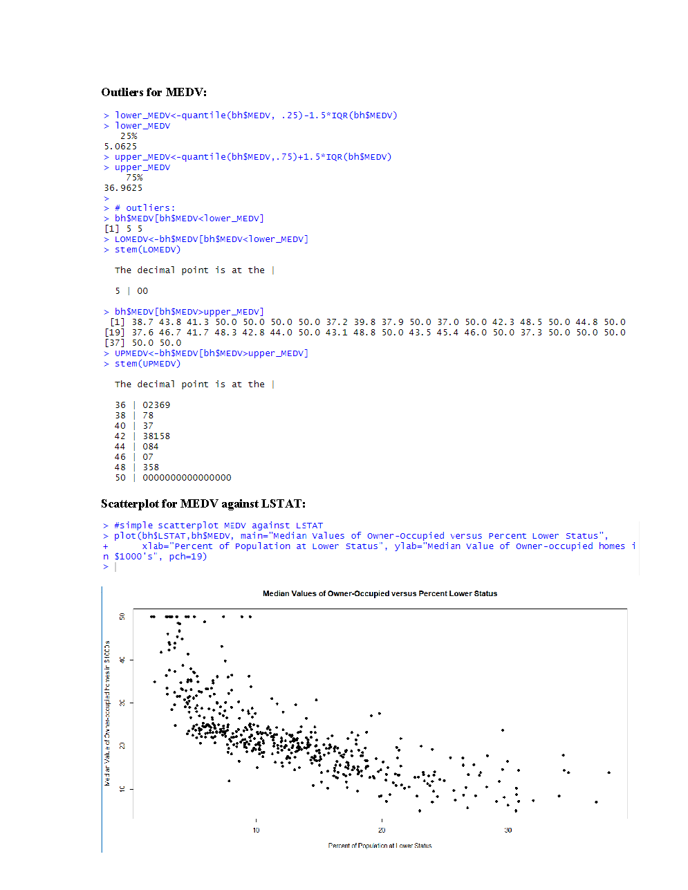
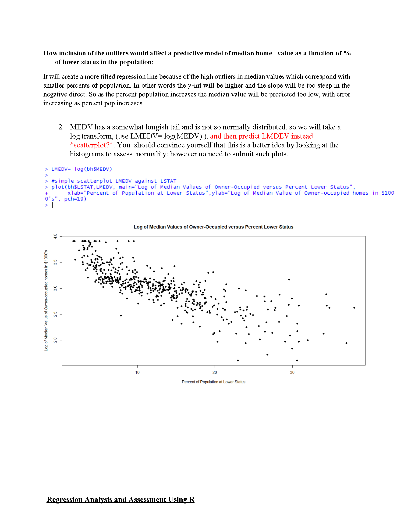
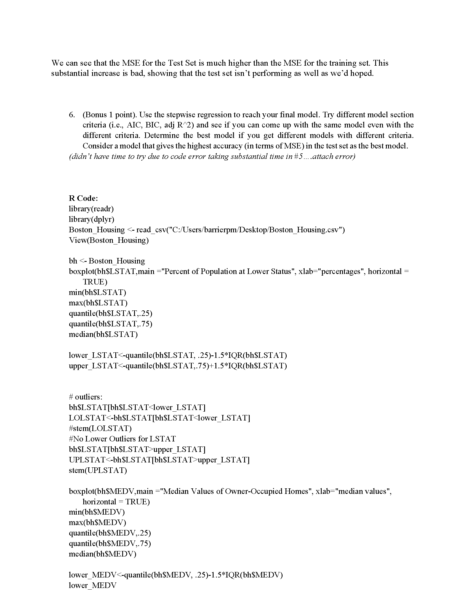
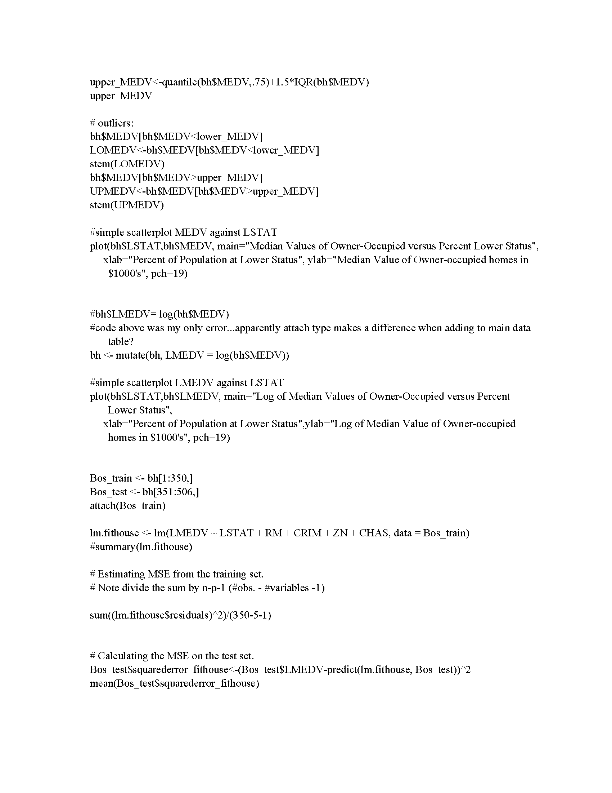

Here is a sample of my work from assignments in DSBA 6201, Business Intelligence and Analytics, at UNCC.
Most assignments were required to be completed by-hand initially (for conceptual understanding) then solved using R coding.

   
* Data Exploration and Multiple Linear Regression (MLR) using R:
* Data Warehouse Design
* ROC Curve & Confusion Matrix
* Decision Trees
* Clustering
* Association Rule Mining

<section style="position:relative">
      

        

          <ul class="glide__slides">
            <li class="glide__slide">
              
            </li>
            <li class="glide__slide">
              
            </li>
            <li class="glide__slide">
              
            </li>
            <li class="glide__slide">
              
            </li>
            <li class="glide__slide">
              
            </li>
             <li class="glide__slide" a id=#"testing">
                </a>
            </li>
            <li class="glide__slide">
              
            </li>
          </ul>
        

        

          <button class="glide__arrow text-default position-static" data-glide-dir="<"><i class="ni ni-bold-left"></i></button>
          <button class="glide__arrow text-default position-static" data-glide-dir=">"><i class="ni ni-bold-right"></i></button>
        

      

</section>
