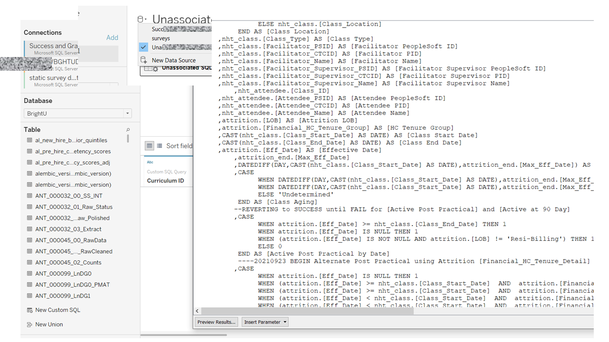
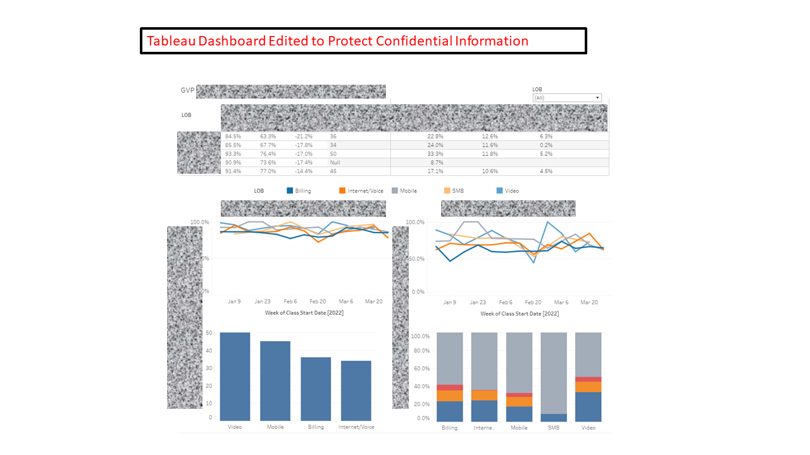
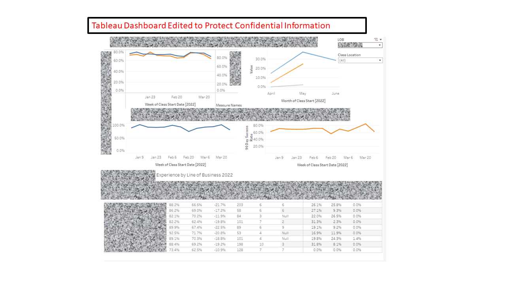

Worked with group of 3 to create Tableau and PowerBI visualizations leveraging strong storylines for comprehensive insurance claims and healthcare data.

**Right click on any sliding image below then select ‘View Image’ to see it larger.**
 <section style="position:relative">
            

    

        <ul class="glide__slides">
                   <li class="glide__slide">
            
        </li>
           <li class="glide__slide">
            
        </li>
           <li class="glide__slide">
            
         </li>
        </ul>
    

    

          <button class="glide__arrow text-default position-static" data-glide-dir="<"><i class="ni ni-bold-left"></i></button>
          <button class="glide__arrow text-default position-static" data-glide-dir=">"><i class="ni ni-bold-right"></i></button>
    

              </section>
