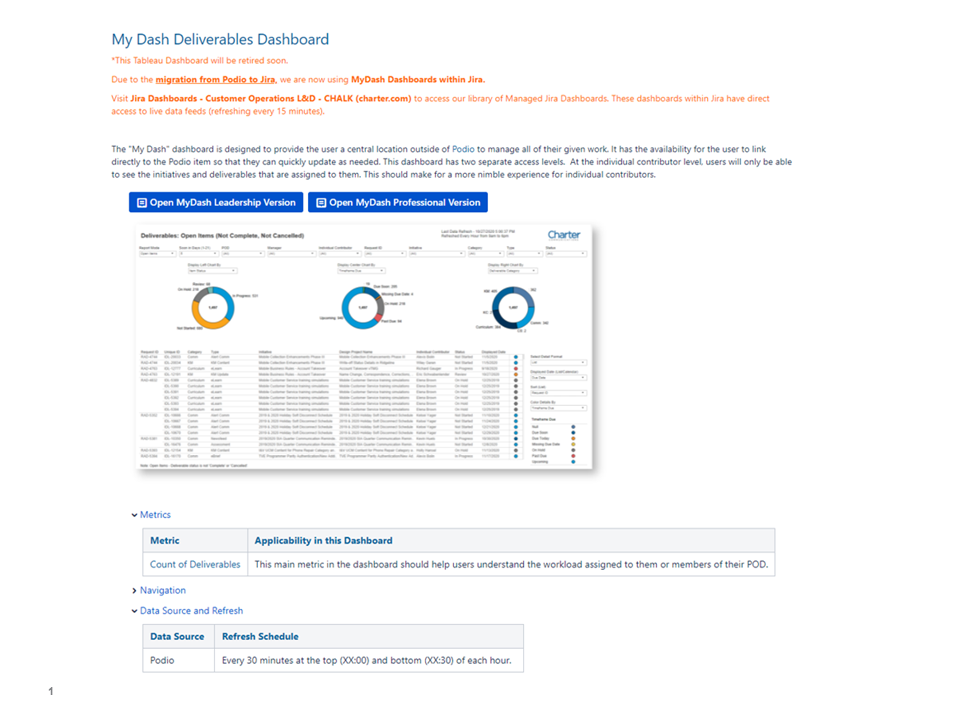
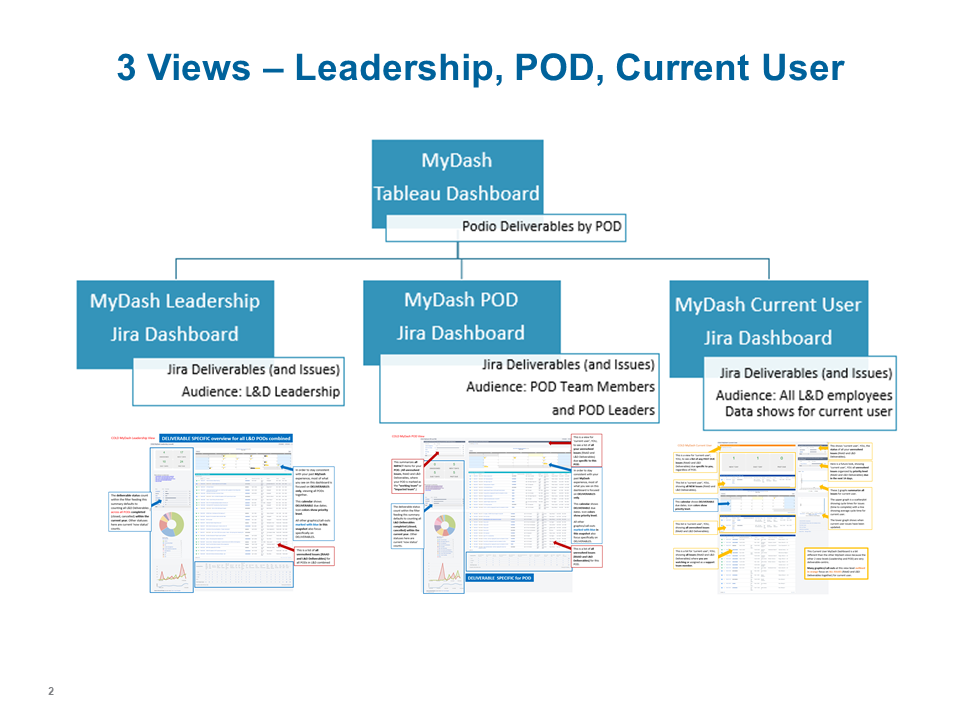
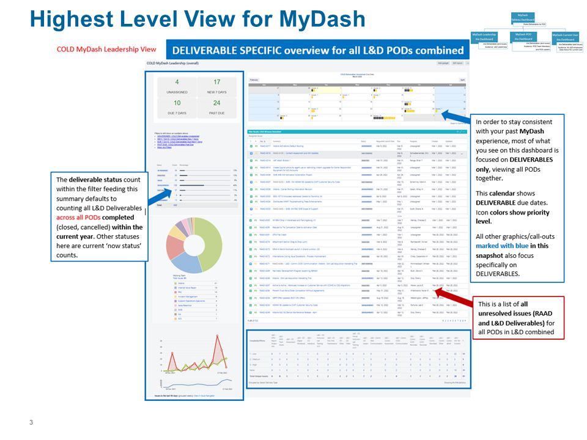
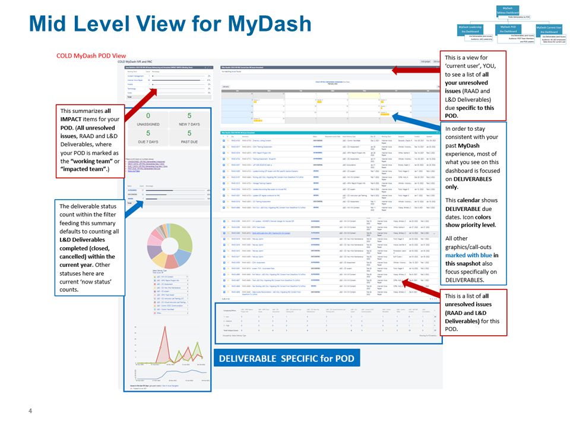
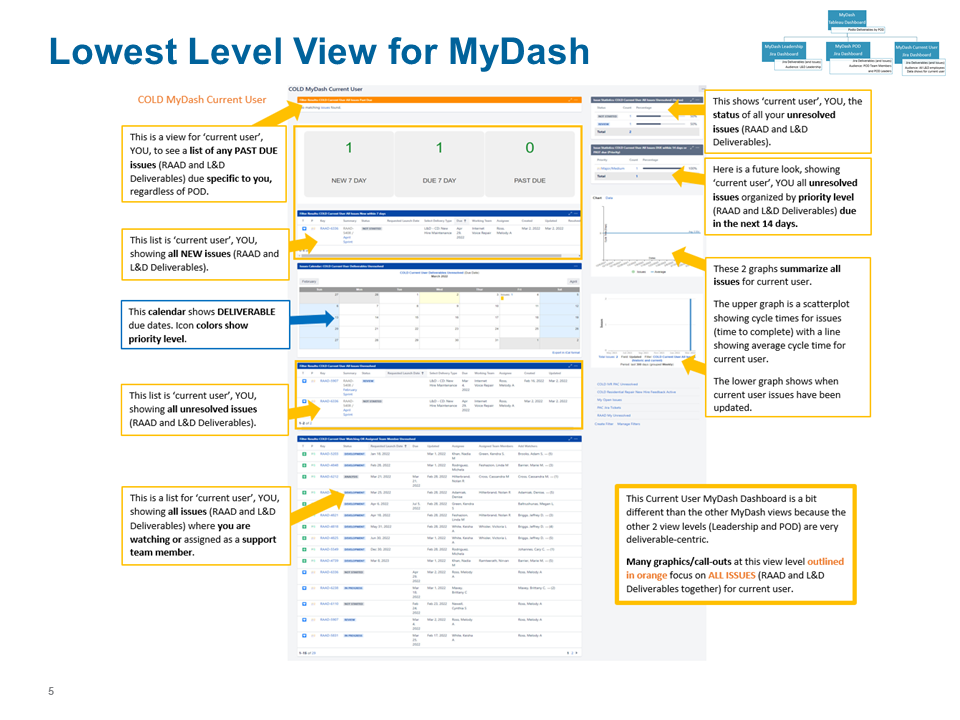

Co-led conversion from Podio to Atlassian Jira for operational intake and reporting, included reporting
needs analysis, development of 70+ custom dashboards, 130+ custom JQL filters, and implementation training and support.

Below is a sample of the MyDash Suite created within Atlassian Jira, replacing legacy Tableau Dashboards.

   <section style="position:relative">  
                 
              
              
              
                         
    </section>
